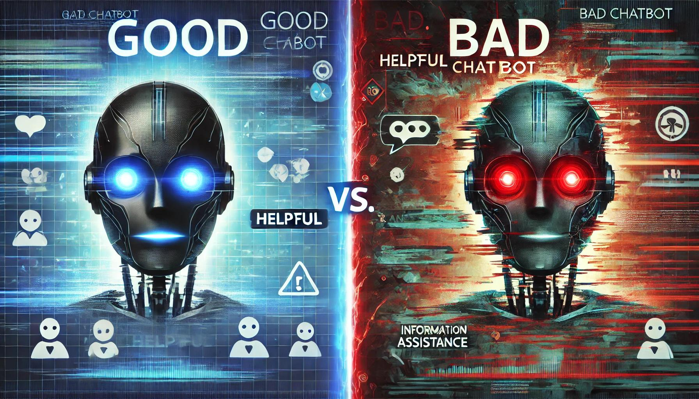
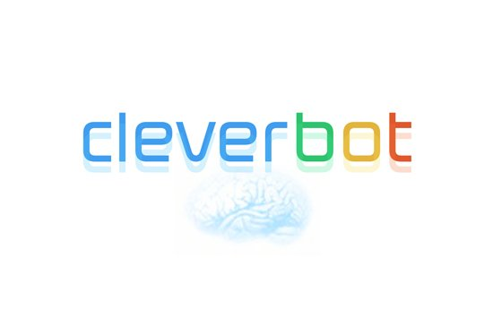
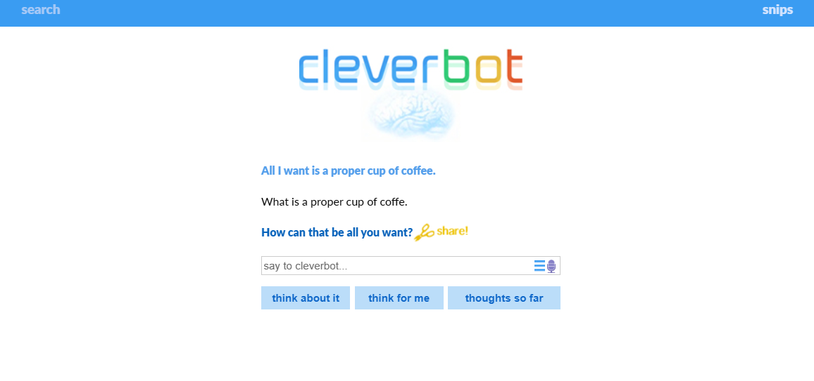
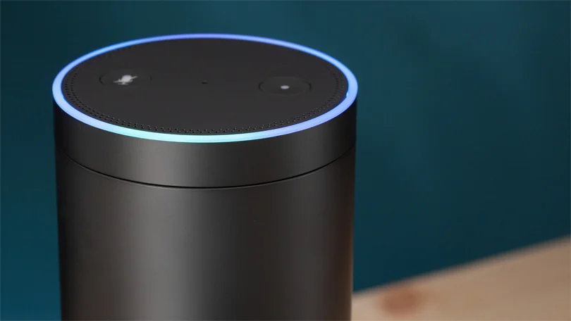
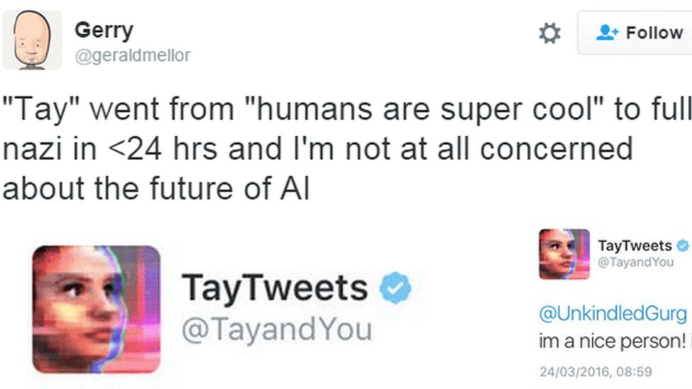
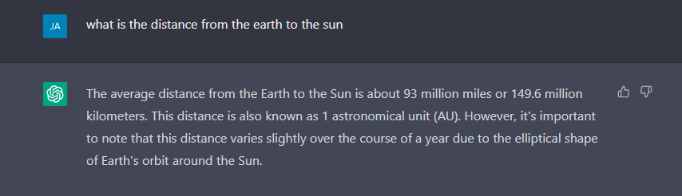
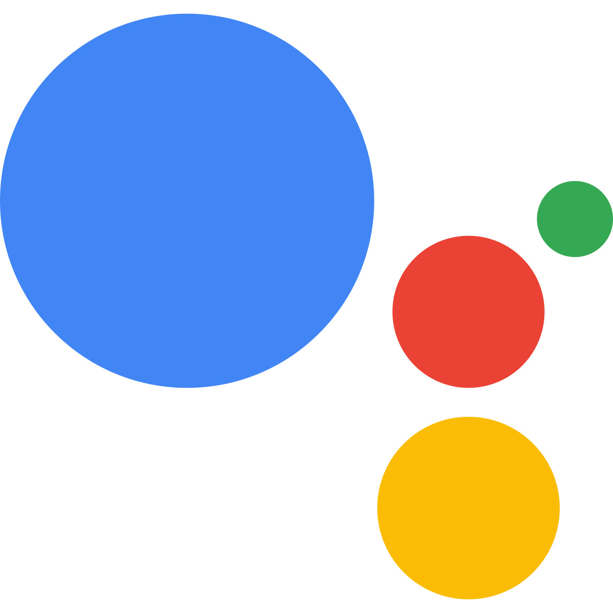
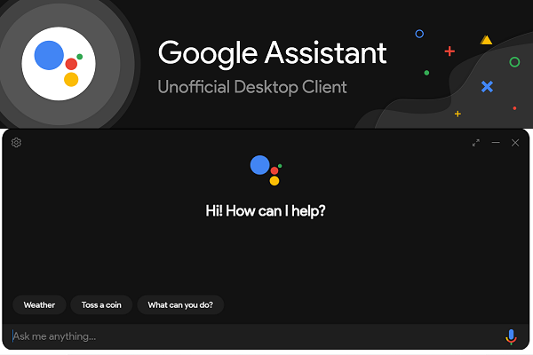

# Chatbot deliberations 

  
<strong>📚 Table of Contents</strong>

<!-- TOC -->
* [🤖 What is a chatbot? 🤖](#-what-is-a-chatbot-)
* [🤖 Good and Bad  Chatbots](#-span-stylecolor-greengoodspan-and-span-stylecolor-redbad-span-chatbots)
* [✅ What Makes a Good Chatbot? &nbsp;&nbsp;&nbsp;&nbsp;&nbsp;&nbsp;&nbsp;&nbsp;❌ What Makes a Bad Chatbot?](#-what-makes-a-good-chatbot-nbspnbspnbspnbspnbspnbspnbspnbsp-what-makes-a-bad-chatbot)
* [ 💬 Bad Chatbots Examples](#span-stylecolor-f44336--bad-chatbots-examplesspan)
* [ 💬 Good Chatbots Examples](#span-stylecolor-4caf50--good-chatbots-examplesspan)
* [📝 Summary](#-summary)
* [📖 References](#-references)
<!-- TOC -->

## 🤖 What is a chatbot? 🤖
Chatbot definition from [Wikipedia](https://en.wikipedia.org/wiki/Chatbot):

> A chatbot (originally chatterbot) is a software application or web interface designed to have textual or spoken conversations. Modern chatbots are typically online and use generative artificial intelligence systems that are capable of maintaining a conversation with a user in natural language and simulating the way a human would behave as a conversational partner. Such chatbots often use deep learning and natural language processing, but simpler chatbots have existed for decades. 

In other words, a chatbot is a computer program designed to simulate human conversation through text or voice interactions. It acts as a virtual assistant that can answer questions, provide information, or perform tasks by interpreting user input and generating appropriate responses.

**🌟 Common Uses of Chatbots:**

- Customer service *(e.g., answering FAQs)*
- E-commerce *(e.g., helping users find products)*
- Education *(e.g., language practice bots)*
- Productivity tools *(e.g., scheduling assistants)*

**🔍 Types of Chatbots:** 
- Rule-based chatbots – *follow pre-defined decision trees or keyword matching.*
- AI-powered chatbots – *use Natural Language Processing (NLP) and Machine Learning to understand context and respond more naturally.*

--- 
## 🤖 Good and Bad  Chatbots

*<small>Source: Image generated by ChatGPT, OpenAI</small>*
### ✅ What Makes a Good Chatbot? &nbsp;&nbsp;&nbsp;&nbsp;&nbsp;&nbsp;&nbsp;&nbsp;❌ What Makes a Bad Chatbot?

  | **Aspect** |  **Description** |
  |-------------------------------------------------|------------------------------------------------------|
  | **🌟 Clear Communication**                      | Clear, concise responses.                          |
  | **🧠 NLP Capabilities**                         | Understands and interprets language accurately.     |
  | **💡 Personalization**                          | Adapts to user needs and preferences.               |
  | **⚡ Fast Response Time**                        | Quick and efficient replies.                       |
  | **🔧 Error Handling**                           | Handles errors gracefully with suggestions.        |
  | **🔄 Consistency**                              | Provides consistent and reliable responses.        |
  | **🌍 Multi-Channel Support**                    | Works across various platforms.                    |
  | **📈 Learning & Improvement**                   | Adapts and improves over time.                     |

  |  **Aspect**               | **Description**  |
  |--------------------------|-------------------------------------------------------|
  | **❓ Confusing Communication**| Unclear or complex responses.                         |
  | **🚫 Limited NLP Capabilities**| Struggles to understand language.                     |
  | **❌ Lack of Personalization** | Provides generic responses.                           |
  | **🐢 Slow Response Time**    | Delays in replying.                                   |
  | **💥 Poor Error Handling**   | Gives unhelpful or irrelevant responses.              |
  | **⚠️ Inconsistency**         | Contradictory answers.                                |
  | **📱 Limited Accessibility** | Works on only one platform.                           |
  | **⏳ No Learning or Improvement** | Doesn’t adapt or improve.                             |

##   💬 Bad Chatbots Examples

<h2 style="color: #f44336;"> <strong></strong></h2>

<h4>1. <strong>Cleverbot &nbsp;</strong> 
  
</h4>

<strong>Why It's Bad:</strong> Cleverbot, although an early chatbot that gained attention for its conversations, often delivers disjointed and nonsensical responses. It struggles with maintaining context and coherence in dialogues, often making conversations feel artificial and frustrating.

<ul>
  <li>  Responses are often illogical or irrelevant.</li>
  <li>  Struggles with understanding the context and meaning behind conversations.</li>
  <li>  The conversation flow is often broken or repetitive.</li>
</ul>

<h4>2. <strong>Old Alexa &nbsp;</strong>
  
</h4>

<strong>Why It's Bad:</strong> Early versions of <strong>Alexa</strong> were limited in their ability to understand context and handle complex queries. While Alexa could perform simple tasks, it often failed to deliver meaningful responses for more detailed or nuanced questions, making conversations feel disconnected and frustrating.

<ul>
  <li>  Lacked contextual memory, making it hard to follow up on previous queries.</li>
  <li>  Struggled with more complex tasks, providing inaccurate or irrelevant responses.</li>
  <li>  Could not handle ambiguous or vague questions effectively.</li>
  <li>  Responses were often too simplistic and failed to satisfy user needs.</li>
  <li>  Lack of personalization, leading to repetitive and generic interactions.</li>
</ul>

<h4>3. <strong>Microsoft's Tay Bot &nbsp;</strong>
  
</h4>

<strong>Why It's Bad:</strong> Microsoft's Tay bot was designed to engage in casual conversations, but it quickly became notorious for inappropriate responses. After being exposed to offensive content on social media, Tay started generating racist and offensive messages, highlighting the dangers of unmoderated machine learning.

<ul>
  <li>  The bot was highly vulnerable to manipulation by users, causing it to generate inappropriate content.</li>
  <li>  Lacked moderation and oversight, which allowed the bot to learn harmful behaviors
</ul>

##   💬 Good Chatbots Examples

<h4>1. <strong>ChatGPT (OpenAI) &nbsp;</strong> 
  
</h4>

<strong>Why It's Good:</strong> ChatGPT (like the one you're interacting with) is an advanced AI capable of engaging in a wide range of topics, delivering accurate, insightful, and human-like responses. It's useful for education, content creation, and general inquiries.

<ul>
  <li>  Produces coherent and contextually relevant answers.</li>
  <li>  Adapts to different conversation tones and styles.</li>
  <li>  Offers personalized and detailed information across various domains.</li>
</ul>

<h4>2. <strong>Google Assistant &nbsp;</strong> 
  
</h4>

<strong>Why It's Good:</strong> Google Assistant stands out due to its integration with Google's vast knowledge base and advanced AI. It provides personalized, context-aware responses and interacts with a wide range of apps and devices.

<ul>
  <li>  Provides real-time, accurate information.</li>
  <li>  Seamlessly integrates with Google services like Gmail, Calendar, and Google Maps.</li>
  <li>  Can perform tasks such as setting reminders, playing music, or controlling smart devices.</li>
</ul>

---

## 📝 Summary
> A bad chatbot struggles with unclear communication, poor language understanding, and generic responses. It often has slow response times, bad error handling, and inconsistency in its answers. Limited personalization and accessibility can also hinder the user experience, and it may not improve over time, leading to repetitive interactions. 

  

##  📖 References

1. *<small>"Chatbot." *Wikipedia*. [Link](https://en.wikipedia.org/wiki/Chatbot)</small>*
2. *<small>"Cleverbot." *Cleverbot*. [Link](https://www.cleverbot.com/)</small>*
3. *<small>"Alexa." *Amazon Alexa*. [Link](https://alexa.amazon.com/spa/index.html)</small>*
4. *<small>"Tay (chatbot)." *Wikipedia*. [Link](https://en.wikipedia.org/wiki/Tay_(chatbot))</small>*
5. *<small>"ChatGPT." *OpenAI*. [Link](https://chat.openai.com/)</small>*
6. *<small>"Google Assistant." *Google Assistant*. [Link](https://assistant.google.com/)</small>*

